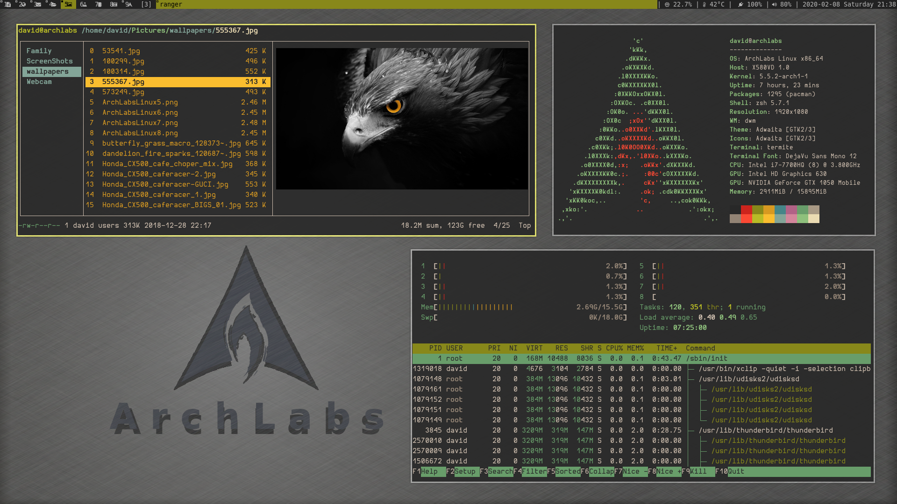

LINUX
=====
Na tej strani lahko najdete nekaj napotkov za Linux-e...



- TOC
{:toc}

INSTALLATION
==============

PACMAN
------
Package manager za ARCH. Nekaj splo/nih ukazov:

|      Akcija | ukaz                                                           |
|------------:|----------------------------------------------------------------|
| inštalacija | `sudo pacman -S ime_programa`                                  |
|    odstrani | `sudo pacman -Rns ime_programa`                                |
|   downgrade | `sudo pacman -U /var/cache/pacman/pkg/ime_programa.pkg.tar.xz` |
|    pkg info | `pacman -Q --info ime_programa`                                |

Nastavitev pacmana najdeš v datoteki: `/etc/pacman.conf`.

TRIZEN
------
Package manager za programe iz AUR repository-ja...

YAY
---
Še en package manager za AUR in ...

TERMINAL (SHELL & PROGRAMS & COMMANDS)
========================================

SHELL
-----

### ZSH

TERMINAL EMULATOR
-----------------

### TERMITE

### TERMINATOR

PROGRAMS
--------

### RANGER
Cool "the best" File manager. Sicer napisan v pythonu, ampak še vedno hiter. Omogoča:

- vim bindings
- goto directory key shortcuts
- lahko kličeš svoje skripte
- preklop v shell (Shift+s)
- predogled filov: slike, video, programsko kodo
- ...

### NEOVIM

#### Avtomatsko popravljanje napak

najprej si zapomnimo mesto kjer smo `ms`, nato s spell-check-erjem najdemo napako `[s`, iz menuja izberemo 1. predlog `1z=` in skočimo nazaj na masto "s" `'s`  

```bash
:normal!  ms[s1z=`s<CR>
```

#### Save vim session
Zapimni si vse odprte dokumente:

```bash
:mksession! ~/.config/nvim/david_session.sav
```

### DMENU

Še en zelo uporaben `SUCKLESS` program. Dmenu je menu, ki prikaže poljuben text, uporabniku nudi izbiro iz menija in izbran text poda kot izhod. Na primer: meni z dvema izbirama bi izgledal takole:

```bash
echo "Prva moznost\nDruga moznost" | dmenu -l 10
```

### PANDOC
Program za pretvorbo dokumentov. Naveč ga uporabljam za pretvorbo iz `MARKDOWN` dokumentov v `PDF` dokumente. Na primer:  

```bash
pandoc --from markdown -F pandoc-crossref -F pandoc-citeproc --template eisvogel --listings --pdf-engine=xelatex index.md -o index.pdf
```

V verziji pandoc 2.8 mi niso delale slike...  

- odstraniš grffile iz templata in je ok (menda da delajo na tem...)

**Skripta**  
Lahko bi v templatu definral različne listingse.

``` vaja
VAJA: NAPETOSTNI POTENCIALI IN NAPETOST
Zanima me kako bi zgledalo tole v dokumenti, če bi podajal naloge za študente v taki obliki.
A je v tem listingsu vsaka vrstica naoisana v novi 
nrstici.
```

PROGRAM UTILS
-------------

### GENERAL EXPRESSIONS

| EXPRESSION | Funkcija                                          |
|:----------:|---------------------------------------------------|
|    [0-9]   | Številka                                          |
|    [a-z]   | Mala črka                                         |
|      .     | Katerikoli znak                                   |
|      ^     | Začetek vrstice                                   |
|      $     | Konec vrstice                                     |
|      *     | Predhodni znak se lahko ponovi nikoli ali večkrat |


### GREP

### SED

### AWK

PROGRAMS (GUI-like)
===================

Za vsak program lahko določimo v katero katero spada in kako ga zaženemo. Te možnosti programa so zapisane v:  
`/usr/share/applications/IME_PROGRAMA.desktop`

katere kategorije so vpisane v vseh programih lahko pogledamo z ukazom:  

```bash
#! /bin/zsh
grep Categories /usr/share/applications/* | sed 's/^.*=//;s/\;/\n/g' | sort | uniq
echo "To je test..."
```

OFFICE
------

HARDWARE
========

ARDUINO
-------

### ARDUINO WAVGAT

1. prenesi [WAVGAT drivers]( https://github.com/ericvb/Arduino-WavGat-Drivers )
2. skopiraj ./update/* v ~/Arduino/*
3. za Linuxe popravi:
    
    `../hardware/WAV/avr/boards.txt:lardu_328p.bootloader.file=lgt8fx8p\optiboot_lgt8f328p.hex`
    `../hardware/WAV8F/boards.txt:lardu_328p.bootloader.file=lgt8fx8p\optiboot_lgt8f328p.hex`

4. ponovno zaženi Arduino IDE in izberi `Tools - Boards - WAVGAT UNO R3`


## HP - PRINTERS

Imel sem težave s HP printerjem... rešil sem tako, da sem naložil nazaj:

- HPLIP ( hplip 1:3.19.11-4 ) in 
- CUPS ( cups 2.3.0-4 )
