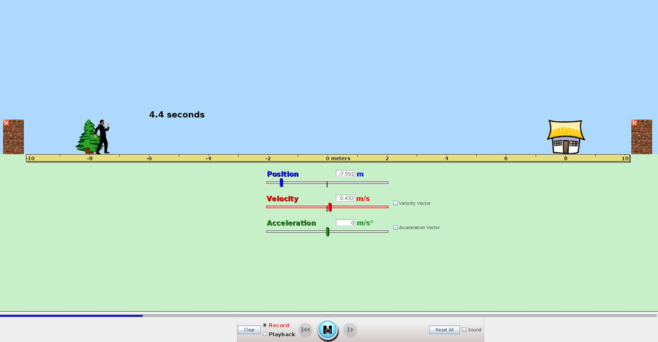

# Simulacije fizikalnih pojavov

# Klasično opazovanje pojavov

Oglejmo si video simulacije enakomernega gibanja. Simulacijo smo izbrali zato, da lahko nadzorujemo hitrost, ki jo bomo kasneje lahko primerjali z izmerjeno.

{#fig:walking_man_veloc.png}

Izmerimo vmesne čase oddaljenosti osebe na vsake 2 m in jih uredimo v tabeli.

Za meritev časov lahko uporabite spletno merilno uro [link](https://www.timeanddate.com/stopwatch/).

Ta spletna različica časovnega merilnika omogoča izvoz časov v beležnico in tako enostaven copy-paste v Excel.

Čase lahko pretvorimo v sekunde tako, da celico pomnožimo s 24h*60min*60sec (zaokrožimo na 3 dec)

Poizkus večkrat ponovimo in rezultate vnesemo v tabelo.

## PORAZDELITEV MERITEV

    =MIN(B3:U3)
    =MAX(B3:U3)

Naredimo rang od MIN - MAX in   

    =FREQUENCY(data; rang)

[Normalna porazdelitev podatkov](https://en.wikipedia.org/wiki/Standard_deviation)

## IZRAČUN POVPREČJA

Povprečna vrednost:  
    
    =AVERAGE(B3:U3)

Standardni odklon

    =STDDEV()

## NORMALNA PORAZDELITEV

[Normalna porazdelitev](https://en.wikipedia.org/wiki/Normal_distribution#Standard_deviation_and_coverage)

[Normalna porazdelitev - GEOGEBRA](https://www.geogebra.org/m/AxtegHsz)

Verjetnost, da se vzorec nahaja v nekem območju X_min -> X_max

## Standardna napaka ocene pov. vrednosti

## interval zaupanja
Z 90%

absplutna napaka = z*std.nap.oc.pov.vr.

## Predstavitev podatka

povprečje ± abs.napaka

# LINEARIZACIJA 

## naklon
##prosti člen
##korelacija
##standardna napaka ocene pov. prednosti
## Predstavitev podatka

# ANALIZA VIDEA

## Zajem videoposnetka
- ozadje
- kamera miruje

# ANALIZA ZVOKA

## Sinus in FFT
## Pravokotni signal in FFT

$$ x(t)=\frac{4}{\pi}(\sin(\omega t)+\frac{1}{3}\sin(3\omega t)+\frac{1}{5}\sin(5\omega t)+ ...) $${#eq:pravokotni_signa}

Za vse meritve 

vmesni časi
preglednica
vsi v isto
lin reg

zamujajo  ali prehit

# Statistična obdelava podatkov s tabelaričnimi orodji

# Video analiza

# Semarska 
oddaja 
kaj bi bil cilj
s čim 
kaj bo racalo
- potrdim
- delate

naloga 
trakcem ali telefon

# Analiza zvoka

# Literatura
